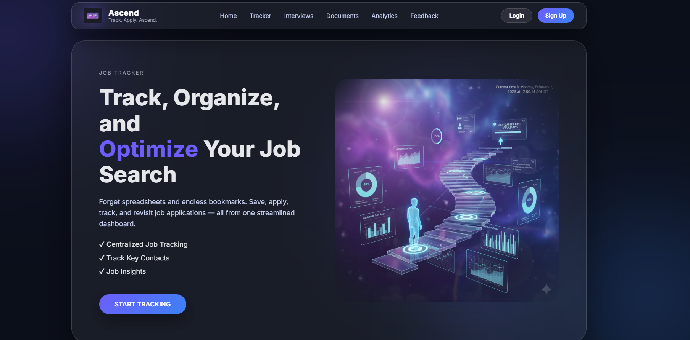
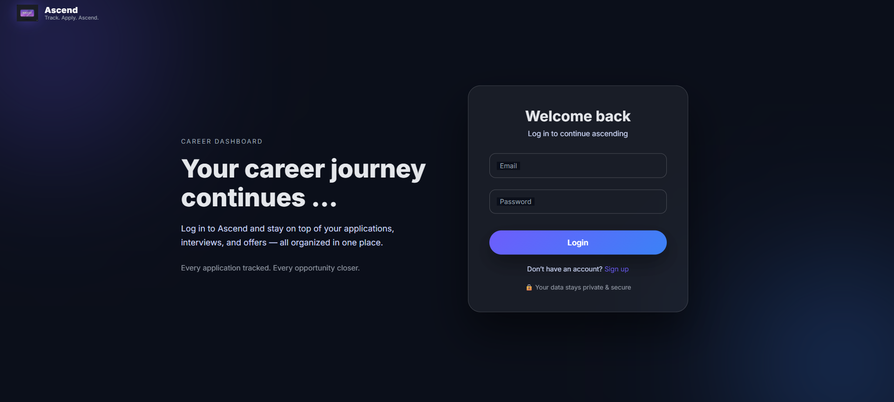
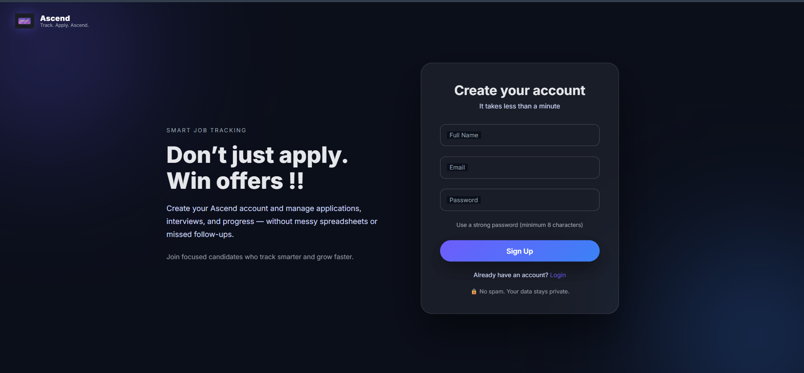
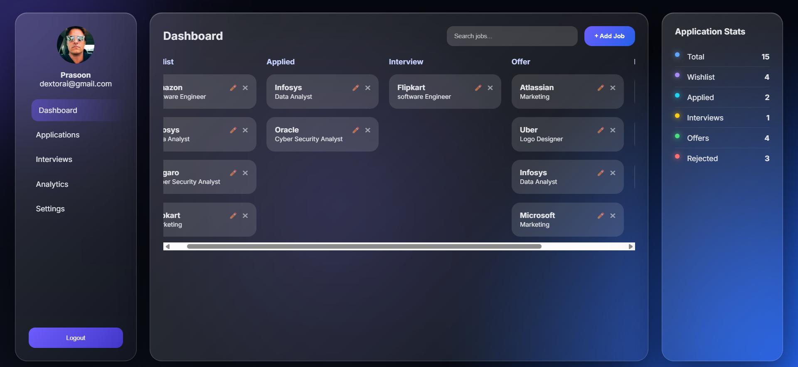
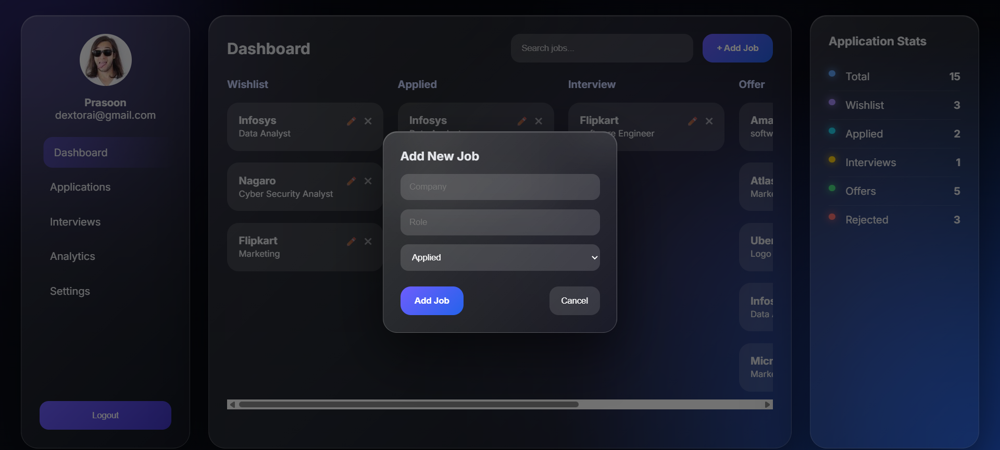
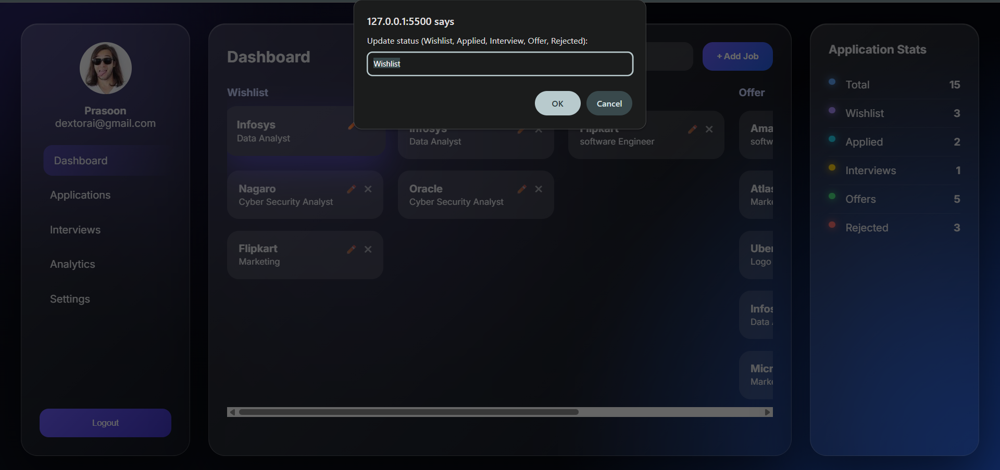
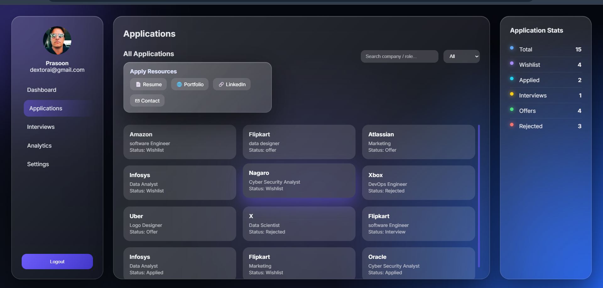
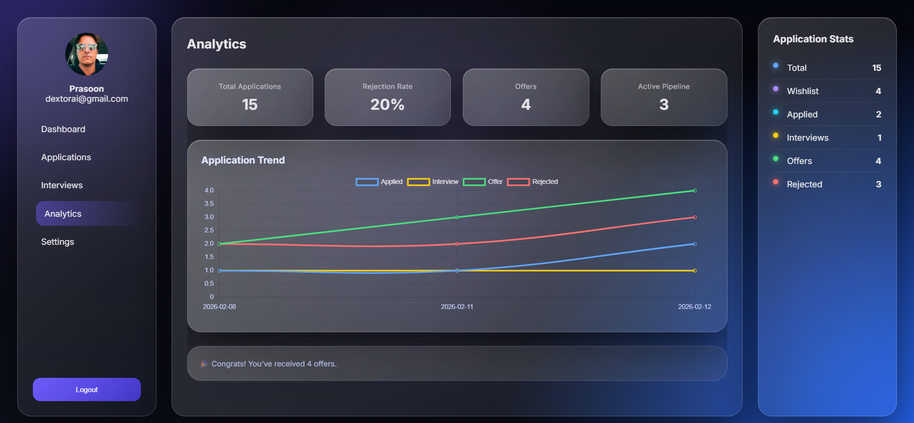
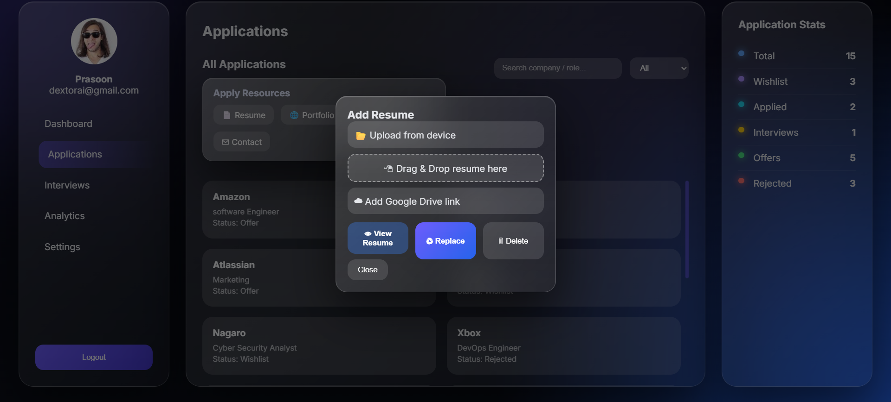
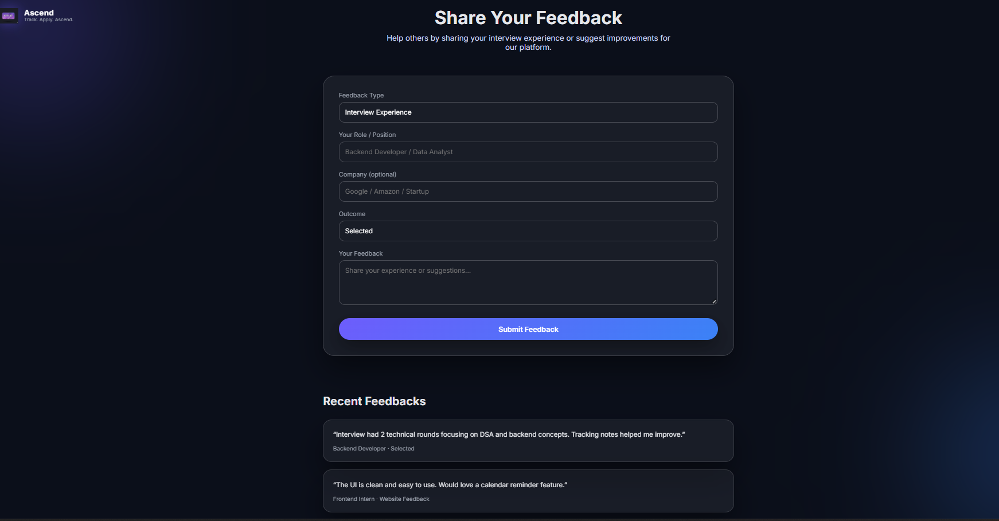

# 📌 Ascend – Smart Job Application Tracker

<p align="center">
  
</p>

A full-stack web application designed to help users **track, organize, and optimize** their job applications in a structured and intelligent way.

Ascend provides secure authentication, personalized dashboards, real-time analytics, resume management, and a peer feedback ecosystem to help candidates grow strategically.

---

## 🌟 Why Ascend?

Instead of messy spreadsheets, Ascend gives you:

- 📊 Visual job pipeline tracking  
- 🔐 Secure authentication  
- 📈 Real-time analytics & insights  
- 📎 Resume management  
- 🤝 Community-driven feedback  

---

## 🔐 Authentication System

<p align="center">
  
</p>

<p align="center">
  
</p>

### ✨ Features

- JWT-based authentication  
- Protected backend routes  
- User-specific data isolation  
- Session handling via `localStorage`  
- Secure login & registration flow  

Each user can only access their own applications.

---

## 📊 Dashboard – Kanban Style Tracking

<p align="center">
  
</p>

Track job applications across stages:

- Wishlist  
- Applied  
- Interview  
- Offer  
- Rejected  

Dynamic rendering from backend API with smooth UI animations.

---

## ➕ Add & Manage Jobs (Full CRUD)

<p align="center">
  
</p>

<p align="center">
  
</p>

Users can:

- Add new job applications  
- Update job status  
- Delete applications  
- Edit progress anytime  

All operations sync instantly with MongoDB.

---

## 📂 Applications Management

<p align="center">
  
</p>

Advanced filtering by:

- Status  
- Company  
- Role  

Clean grid layout with modular CSS structure.

---

## 📈 Analytics & Insights

<p align="center">
  
</p>

Built using Chart.js:

- Total Applications  
- Rejection Rate  
- Offers Received  
- Active Pipeline  
- Multi-line trend graph  
- Real-time cumulative tracking  

Helps users visually understand hiring trends.

---

## 📎 Resume Management System

<p align="center">
  
</p>

Users can:

- Upload resume  
- Replace resume  
- Delete resume  
- Add Google Drive link  

---

## 🤝 Peer Feedback Ecosystem

<p align="center">
  
</p>

Users can share:

- Interview experiences  
- Preparation strategies  
- Learning outcomes  
- Hiring insights  

This transforms Ascend from a tracker into a **career growth platform**.

---

## 🎨 UI / UX Design

- Glassmorphism interface  
- Smooth hover animations  
- Responsive layout (CSS Grid + Flexbox)  
- Cursor-based dynamic lighting  
- Clean modular CSS architecture  

---

## 🛠️ Tech Stack

### 🔹 Frontend
- HTML5  
- CSS3  
- JavaScript  
- Chart.js  

### 🔹 Backend
- Node.js  
- Express.js  

### 🔹 Database
- MongoDB (Mongoose)

### 🔹 Authentication
- JWT (JSON Web Tokens)

### 🔹 Version Control
- Git & GitHub  

---

## 🧠 Architecture Overview

- RESTful API design  
- Modular file structure  
- Middleware-based route protection  
- Scalable MongoDB schema  
- Clean separation of concerns  

---

## 🔄 Real-Time Data Flow

Dashboard & analytics update instantly after:

- Job creation  
- Status update  
- Job deletion  

Fully data-driven — no hardcoded values.

---

## 📦 Installation Guide

### 1️⃣ Clone Repository

```bash
git clone https://github.com/your-username/job-application-tracker.git
```
### 2️⃣ Install Backend Dependencies
```bash
cd backend
npm install

```
### 3️⃣ Setup Environment Variables
Create a .env file inside the backend folder:
```bash
PORT=5000
MONGO_URI=your_mongodb_connection_string
JWT_SECRET=your_secret_key

```
### 4️⃣ Start Server
```bash
npm run dev

```
### 5️⃣ Open Frontend
Open the frontend using Live Server.

---

## 📊 Future Improvements

- Drag & Drop Kanban
- Email reminders 
- Resume analytics
- Admin dashboard
- AI-based interview insights

---
## 🎯 Learning Outcomes

- Full-stack architecture design
- Secure authentication flow
- REST API development
- Real-time data visualization
- State management in Vanilla JS
- Scalable modular frontend structure

---
## ⭐ If You Like This Project

Give it a star ⭐ on GitHub.

